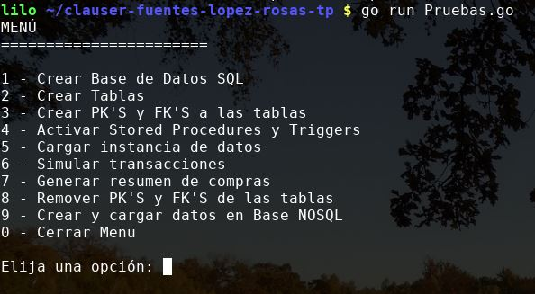

:toc:
:toc-title: Contenidos
:numbered:
:source-highlighter: coderay
:tabsize: 4

= Base de Datos I - Trabajo Práctico - Primer Semestre 2021

Integrantes:

* Clauser Nahuel <nahuelclauser@gmail.com>
* Fuentes Bustos Martín <martinfba@gmail.com>
* López Christian  <chrisnlopez@gmail.com>
* Rosas Juan <jrosas1982@gmail.com>

Docentes:

* Czemerinski Hernán
* Rondelli Hernán

V 1.0 - {docdate}.

== Introducción

El trabajo consiste generar una aplicación en Go que nos permita interactuar con bases de datos que contiene información relativa a tarjetas de crédito. La base contiene las siguientes entidades:

** cliente
** tarjeta
** comercio
** compra
** rechazo
** cierre
** cabecera
** detalle
** alerta
** consumo

Se solicita la creación de la BD, tablas, claves primarias y foráneas. De la misma manera se debe generar una instancia de datos válida.

Por otra parte se pide incluir Stored Procedures y/o Trigger que autoricen la compra, generen el resumen y emitan alertas para casos que cumplan determinadas condiciones. 

Finalmente, empleando una base de datos NoSQL se pide guardar los datos de clientes, tarjetas, comercios y compras. 

== Descripción

Este programa consta de un menú de opciones que al interactuar se van cumpliendo las consignas solicitadas. Están ordenadas de manera que permita al usuario verificar las funcionalidades de cada solicitud planteada en el trabajo práctico. Eso justifica la disgregación de las mismas.

.Menú Principal

==== Opción 1 - Crear base de datos SQL
Crea la base de datos con el nombre _dbcard_, verifica si existe previamente y la elimina.

==== Opción 2 - Crear tablas
Se conecta a la base _dbcard_ y crea las diez tablas con los atributos solicitados con su correspondiente tipo de datos.

==== Opción 3 - Crear PK'S y FK'S a las tablas
Establece las claves primarias y foráneas de cada tabla.

==== Opción 4 - Activar Stored Procedures y Triggers
Establece dos _Stored Procedure_ y cuatro _Triggers_. Los SP corresponden a la autorización de la compra y la generación del resumen. Mientras que los triggers son establecidos en las tablas de _compra_ y _rechazo_ para disparar las alertas solicitadas.

==== Opción 5 - Cargar instancia de datos
Inserta datos en las tablas _cliente, comercio, tarjeta, consumo_ y _cierre_.

==== Opción 6 - Simular transacciones
Recorre la tabla consumo y verifica si las compras están autorizadas en caso afirmativo se insertan en la tabla _compra_ de lo contrario en _rechazo_.

==== Opción 7 - Generar resumen de compras
Completa en las tablas de _cabecera_ y _detalle_ de un determinado cliente en el período solicitado (año y mes).

==== Opción 8 - Remover PK'S y FK'S de las tablas
Elimina las claves primarias y foráneas de cada tabla.

==== Opción 9 - Crear y cargar datos en Base NO-SQL
Crea la base de datos con el nombre _tarjetas.db_, la cual contiene datos de clientes, comercios, tarjetas y compras. Se emplea 3 funciones una para leer un bucket, otra para crearlo o actualizarlo y por último una función que agrega los datos existentes en la base SQL de _dbcard_.

==== Opción 0 - Cerrar Menu
Finaliza la ejecución del programa.

==== Dificultades, decisiones y soluciones.

Como modalidad de trabajo, inicialmente, empleamos un desarrollo en conjunto con reuniones sincrónicas donde uno de los integrantes era el que escribia el código pora luego actualizarlo en el repositorio. Posteriormente modificamos la metodología de trabajo para poder cumplir con que cada uno debería contar con commits que verificaran la participación en el desarrollo. A partir de ello, dividimos algunas consignas para el desarrollo individual. Aunque se mantuvo las reuniones sincrónicas para puestas en común.

Durante el transcurso del trabajo nos encontramos algunas problemáticas.

Tuvimos diferencias con respecto a lo que cada uno entendía con respecto a las consignas y el producto final del trabajo. Se barajaron opciones como que debía ser un archivo de *SQL* que los docentes emplearian con una aplicación en *GO* que probaría si era correcto. Dudas que terminamos de disolver con als clases de consultas.

Al momento de responder la consigna relacionada Store Procedure and Tiggers quizás por no tener en claro los conceptos de cada uno nos costo encarar el SP de autorización de compra, inicialmente nos lo planteamos como un trigger después de debatir y volver a ver las clases teóricas nos dimos cuenta que era lógica en la base de datos.

Con respecto al punto de *JSON* y *NOSQL* tuvimos inconvenientes con la visibilidad de los atributos de los struct que habiamos colocado como privados. Lo solucionamos estableciendo en cliente, tarjeta, comercio y compras como públicas(Primera letra en mayúscula).

Frente a la consigna de registrar un alerta cada vez que exista un rechazo, surgio el inconveniente de querer acceder al _nrorechazo_ que al ser establecido con de tipo serial no estaba asignado hasta que se insertaba en la tabla lo cual nos genera un error porque el triggerlo estabamos accionando antes (_before_) de la inserción, se soluciono cambiando la forma de accionar.(_after_).

Cuando establecimos las claves primarias y foráneas establecimos dentro de la tabla de alertas como FK el atributo de _nrorechazo_ porque lo relacionamos con el existente en la tabla _rechazo_.

*alter table alerta add constraint alerta_nr_fk foreign key (nrorechazo) references rechazo(nrorechazo);*

Lo cual una vez avanzado el trabajo pudimos observar que ese campo tambien era alterado cuando triggers se ejecutaban desde la tabla _compra_ que no contenía dicha columna. Por ende no estaban relacionados los campos sino era un alcance en la nomenclatura. Se soluciono eliminando dicha relación.

== Implementación
Para la realización de este trabajo se desarrollaron las siguientes funciones:

==== _CreateDatabase_
La función no se puede emplear si estas conectado a la base con otra terminal.
[source, go]
----
func CreateDatabase() {

	db, err := sql.Open("postgres", "user=postgres host=localhost dbname=postgres sslmode=disable")
	if err != nil {
		log.Fatal(err)
	}
	defer db.Close()

	_, err = db.Exec(`drop database if exists dbcard`)
	if err != nil {
		log.Fatal(err)
	}

	_, err = db.Exec(`create database dbcard`)
	if err != nil {
		log.Fatal(err)
	}
}
----

==== _Función VirtualBuys_ 
La función _VirtualBuys_ no recibe parámetros ni retorna valores durante se ejecución inserta en la tabla compra un row si el SP _autorizacioncompra_ devuelve verdadero.
[source, go]
----
func VirtualBuys() {

	db, err := sql.Open("postgres", "user=postgres host=localhost dbname=dbcard sslmode=disable")
	if err != nil {
		log.Fatal(err)
	}
	rows, err := db.Query(`select * from consumo`)
	if err != nil {
		log.Fatal(err)
	}
	defer rows.Close()
	var a consumo

	for rows.Next() {
		if err := rows.Scan(&a.nrotarjeta, &a.codseguridad, &a.nrocomercio, &a.monto); err != nil {
			log.Fatal(err)
		}
		var autorizacioncompra bool
		sqlStatement1 := `select  autorizacioncompra($1, $2, $3, $4 )`
		err := db.QueryRow(sqlStatement1, a.nrotarjeta, a.codseguridad, a.nrocomercio, a.monto).Scan(&autorizacioncompra)
		if err != nil {
			log.Fatal(err)
		}
		if autorizacioncompra == true {
			sqlStatement := ` INSERT INTO compra (nrotarjeta, nrocomercio, fecha, monto, pagado)
				VALUES ($1, $2, $3, $4, $5)`
			_, err = db.Exec(sqlStatement, a.nrotarjeta, a.nrocomercio, time.Now(), a.monto, false)
			if err != nil {
				log.Fatal(err)
			}
			//fmt.Printf(" Se registro la compra exitosamente >> %v %v %v %v\n", a.nrotarjeta, a.codseguridad, a.nrocomercio, a.monto)
		} else {
			//fmt.Printf(" Error:  Intente mas tarde >> %v %v %v %v\n", a.nrotarjeta, a.codseguridad, a.nrocomercio, a.monto)
		}
	}
	if err = rows.Err(); err != nil {
		log.Fatal(err)
	}

}

----

==== _Función SummarySales_
La función no recibe paramétros, emplea el SP _generaresumen_ con los datos del cliente 548308 y el período de marzo de 2021.

[source, go]
----
func SummarySales() {

	db, err := sql.Open("postgres", "user=postgres host=localhost dbname=dbcard sslmode=disable")
	if err != nil {
		log.Fatal(err)
	}

	defer db.Close()

	sqlStatement2 := `  select  generaresumen($1, $2)`
	rows, err := db.Query(sqlStatement2, 548308, 03)
	if err != nil {
		log.Fatal(err)
	}
	defer rows.Close()

}
----

==== _Función StoreProcedures_
La función no recibe paramétros, es el código de los SP _autorizacioncompra_ y _generaresumen_. El primero devuelve un booleano mientras que el segundo inserta rows en las tablas de cabecera y detalle.
[source, go]
----
func StoredProcedures() {

	db, err := sql.Open("postgres", "user=postgres host=localhost dbname=dbcard sslmode=disable")
	if err != nil {
		log.Fatal(err)
	}
	defer db.Close()

	_, err = db.Exec(`create or replace function autorizacioncompra (nrotarjetab char(16),  codseguridadb char(4),  nrocomercio int, montob decimal(7,2))  returns boolean as $$

 declare
    resultado record;
	codError int;
	autorizacion boolean;
	motivorechazo text;	

begin

     codError :=0;
--	Que el número de tarjeta sea existente, y que corresponda a alguna tarjeta vigente. En caso de que no cumpla, se debe cargar un rechazo con el mensaje ?tarjeta no válida ó no vigente.
    select * into resultado from tarjeta where tarjeta.nrotarjeta = nrotarjetab;
    if not found then
        motivorechazo='Tarjeta no valida o vigente';
        codError :=1;
    end if;
    -- deberia actualizar rechazo
  
  --Que el código de seguridad sea el correcto. En caso de que no cumpla, se debe cargar un rechazo con el mensaje ?código de seguridad inválido.
    select * into resultado from tarjeta where tarjeta.codseguridad = codseguridadb;
    if not found then
        motivorechazo='El codigo de seguridad es invalido';
         codError :=1;
    end if;
       -- deberia actualizar rechazo
           
  --Que el monto total de compras pendientes de pago más la compra a realizar no supere el límite de compra de la tarjeta. En caso de que no cumpla, se debe cargar un rechazo con el mensaje ?supera límite de tarjeta.
     select   *  into resultado   from tarjeta  where  tarjeta.nrotarjeta =  nrotarjetab and limitecompra > 
     (select  
			case  
				when sum(compra.monto)  is null 
					then 0 
					else 
					sum(compra.monto)  
			end 
	 from tarjeta 
    left join compra
    on tarjeta.nrotarjeta = compra.nrotarjeta  where  compra.pagado = false  and  compra.nrotarjeta = nrotarjetab)  +  montob;
   
    if  not found then    
      motivorechazo := 'Limite Excedido';
       codError :=1;
	end if;
        --deberia actualizar rechazo motivo 
        
  --Que la tarjeta no se encuentre vencida. En caso de que no cumpla, se debe cargar un rechazo con el mensaje ?plazo de vigencia expirado.
	 select * into resultado from tarjeta where tarjeta.nrotarjeta = nrotarjetab  and  to_date(tarjeta.validahasta, 'YYYYMM')  >  current_date;
    if not found then
       -- raise  notice'la tarjeta se encuentra vencida';
       motivorechazo := 'la tarjeta se encuentra vencida';
       codError :=1;
    end if;
        -- deberia actualizar rechazo motivo		
		
  --Que la tarjeta no se encuentre suspendida. En caso que no cumpla, se debe cargar un rechazo con el mensaje la tarjeta se encuentra suspendida.
    select * into resultado from tarjeta where tarjeta.nrotarjeta = nrotarjetab  and tarjeta.estado != 'suspendida';
    if not found then
        --raise notice 'la tarjeta se encuentra suspendida';
        motivorechazo := 'la tarjeta se encuentra suspendida';
        codError :=1;
    end if;
    
       -- deberia actualizar rechazo	
      if( codError = 0) then
			raise notice 'Consumo Autorizado';
			autorizacion := true;
	else 
	raise notice 'Consumo No Autorizado';
	insert into rechazo (nrotarjeta, nrocomercio, fecha, monto , motivo) values (nrotarjetab, nrocomercio, current_timestamp, montob, motivorechazo);
	autorizacion := false;
	end if;
	return autorizacion;
  end ; 

$$ language plpgsql;`)

	if err != nil {
		log.Fatal(err)
	}

	_, err = db.Exec(`   create or replace function generaresumen (nroclienteb int,  periodo int)  returns void as $$

	declare
    resultadoA record;  	--resultado de buesqueda en tabla cliente
    resultadoB record;  	--resultado de busqueda en tabla tarjeta
    resultadoC record;  	--resultado de busqueda en tabla cierre
   	resultadoD  record ; 	-- info para insertar en tabla  detalle
	i int;                             	--  variable para un contador
        
    digito char(1);     			-- extraigo el ultimo digito de la tarjeta
    terminacionb int;  		-- casteo la variable anterior a int 
    total decimal(8,2);  	-- acumulo el total de la compra
    nroresumen int;  --guardo hardcodeado el numero de resumen
    cuenta int;   --acumula cantidad de lineas que va atener el resumen

	begin

--	LEVANTO LOS DATOS DEL CLIENTE DE TABLA CLIENTE
    select * into resultadoA from cliente where cliente.nrocliente = nroclienteb;
    if not found then
        raise 'el nro de cliente % es inválido', nroclienteb;
    end if;

--	LEVANTO NUMERO  DE LA TARJETA DE TABLA TARJETA
    select * into resultadoB from tarjeta where tarjeta.nrocliente = nroclienteb;
    if not found then
        raise 'tarjeta de cliente % no encontrada', nroclienteb;
    end if;
    
    digito := substring (resultadoB.nrotarjeta from 16);
    terminacionb := cast (digito as integer);
    
--	LEVANTO LOS DATOS DEL CIERRE DE TARJETA  DE TABLA CIERRE   
    select * into resultadoC from cierre where cierre.terminacion = terminacionb and cierre.mes = periodo;
    if not found then
        raise 'el nro de tarjeta % es inválida', nrotarjetab;
    end if;

--	SUMO LOS IMPORTES DE CADA COMPRA EN EL PERIODO SOLICITADO	
	select  sum(monto) into total
	from compra
	where compra.nrotarjeta =  resultadoB.nrotarjeta
	and  compra.pagado = false
    and compra.fecha >= resultadoC.fechainicio
	and compra.fecha <=  resultadoC.fechacierre ;
	

	nroresumen :=25000;   --hardcodeo nroresumen

--	INSERTO LOS DATOS EN LA TABLA CABECERA	
	insert into cabecera( nroresumen, nombre,  apellido, domicilio, nrotarjeta, desde, hasta, vence, total) values(nroresumen, 
	resultadoA.nombre, resultadoA.apellido, resultadoA.domicilio, resultadoB.nrotarjeta, resultadoC.fechainicio, resultadoC.fechacierre,
	resultadoC.fechavto, total);
	
--	INSERTO LOS DATOS EN LA TABLA DETALLE
	i :=0;							
	for resultadoD  in  select compra.fecha, comercio.nombre, compra.monto from compra
									inner join comercio on compra.nrocomercio = comercio.nrocomercio
									where compra.nrotarjeta =  resultadoB.nrotarjeta
									and  compra.pagado = false
									and compra.fecha >= resultadoC.fechainicio
									and compra.fecha <=  resultadoC.fechacierre 
									limit 10
									
    loop
         i := i +1;
	     insert into detalle( nroresumen, nrolinea,  fecha,  nombrecomercio, monto) values (nroresumen, i,
								resultadoD.fecha, resultadoD.nombre, resultadoD.monto);	     
	end loop;

end

$$ language plpgsql;    `)

	if err != nil {
		log.Fatal(err)
	}

}
----

==== _Función triggeralertadosrechazos_
La funcion no recibe parámetros e inserta valores en la tabla alertas se activa antes de cada insert que se realice en la tabla _rechazo_
[source, go]
----
func triggeralertadosrechazos() {
	db, err := sql.Open("postgres", "user=postgres host=localhost dbname=dbcard sslmode=disable")
	if err != nil {
		log.Fatal(err)
	}
	defer db.Close()

	_, err = db.Exec(`create or replace function dosrechazosmismodia()  returns trigger as $$

declare

anteultimorechazo record;

begin

select * into anteultimorechazo from rechazo  where  nrotarjeta=new.nrotarjeta and rechazo.motivo= 'Limite Excedido' order by nrorechazo desc limit 1;
--raise notice 'la tarjeta se encuentra suspendida',anteultimorechazo;
if ( anteultimorechazo.fecha = new.fecha and anteultimorechazo.motivo = new.motivo)  then

update tarjeta set  estado = 'suspendido' where tarjeta.nrotarjeta = new.nrotarjeta;

insert into alerta (nrotarjeta, fecha, nrorechazo, codalerta, descripcion ) 
values (new.nrotarjeta, current_timestamp, new.nrorechazo, 0, 'Tarjeta suspendida por falta de presupuesto.');
end if;
return new;
 end ; 
 
 $$ language plpgsql;
 
 
create trigger dosrechazosmismodia_trg 
before insert on rechazo
for each row
execute procedure dosrechazosmismodia();`)

	if err != nil {
		log.Fatal(err)
	}

}
----

==== _Función alertanuevorechazo_
La funcion no recibe parámetros e inserta valores en la tabla alertas. Se después antes de cada insert que se realice en la tabla _rechazo_
[source, go]
----
func alertanuevorechazo() {
	db, err := sql.Open("postgres", "user=postgres host=localhost dbname=dbcard sslmode=disable")
	if err != nil {
		log.Fatal(err)
	}
	defer db.Close()

	_, err = db.Exec(`create or replace function nuevorechazo()  returns trigger as $$

	
begin
	insert into alerta (nrotarjeta, fecha, nrorechazo, codalerta, descripcion ) values (new.nrotarjeta, current_date, new.nrorechazo, 0, new.motivo);
	return new;
 end ; 

$$ language plpgsql;

create trigger nuevorechazo_trg 
after insert on rechazo
for each row
execute procedure nuevorechazo() ;`)

	if err != nil {
		log.Fatal(err)
	}

}
----

==== _Función comprasconsecutivasalerta_
La funcion no recibe parámetros e inserta valores en la tabla alertas se activa antes de cada insert que se realice en la tabla _compra_
[source, go]
----
func comprasconsecutivasalerta() {
	db, err := sql.Open("postgres", "user=postgres host=localhost dbname=dbcard sslmode=disable")
	if err != nil {
		log.Fatal(err)
	}
	defer db.Close()

	_, err = db.Exec(`create or replace function comprasconsecutivas()  returns trigger as $$

 declare
    ultimacompra record;
	ultimocomerciocp char(8);
	nuevocomerciocp char(8);
	
begin
	
	select * into ultimacompra from compra where nrotarjeta = new.nrotarjeta order by nrooperacion desc limit 1 ;
	
	select codigopostal into ultimocomerciocp from comercio where nrocomercio = ultimacompra.nrocomercio;
	select codigopostal into nuevocomerciocp from comercio where nrocomercio = new.nrocomercio;
	
	
	if (new.nrocomercio!=ultimacompra.nrocomercio
	and ultimocomerciocp=nuevocomerciocp
	and (select date_trunc('hour',new.fecha)) = (select date_trunc('hour',ultimacompra.fecha))
	and  (select extract(minute from (select age (new.fecha,ultimacompra.fecha))) < 1)) 
	then
	insert into alerta (nrotarjeta, fecha, nrorechazo, codalerta, descripcion ) values (new.nrotarjeta, current_timestamp, new.nrorechazo, 1, '2 compras en menos de 1 minuto');
	end if;
	return new;
 end ; 

$$ language plpgsql;

create trigger comprasconsecutivas_trg 
before insert on compra
for each row
execute procedure comprasconsecutivas() ;`)

	if err != nil {
		log.Fatal(err)
	}

}
----

==== _Función comprasconsecutivasalertacincominutos_
La funcion no recibe parámetros e inserta valores en la tabla alertas se activa antes de cada insert que se realice en la tabla _compra_

[source, go]
----
func comprasconsecutivasalertacincominutos() {
	db, err := sql.Open("postgres", "user=postgres host=localhost dbname=dbcard sslmode=disable")
	if err != nil {
		log.Fatal(err)
	}
	defer db.Close()

	_, err = db.Exec(`create or replace function comprasmenorcinco()  returns trigger as $$

 declare
    ultimacompra record;
	ultimocomerciocp char(8);
	nuevocomerciocp char(8);
	
begin
	select * into ultimacompra from compra where nrotarjeta = new.nrotarjeta order by nrooperacion desc limit 1 ;
	
	select codigopostal into ultimocomerciocp from comercio where nrocomercio = ultimacompra.nrocomercio;
	select codigopostal into nuevocomerciocp from comercio where nrocomercio = new.nrocomercio;
	
	if (ultimocomerciocp!=nuevocomerciocp
	and (select date_trunc('hour',new.fecha)) = (select date_trunc('hour',ultimacompra.fecha))
	and  (select extract(minute from (select age (new.fecha,ultimacompra.fecha))) < 5)) 
	then
	insert into alerta (nrotarjeta, fecha, nrorechazo, codalerta, descripcion ) values (new.nrotarjeta, current_timestamp, new.nrooperacion, 1, '2 compras en menos de 5 minuto con diferente CP');
	end if;
	return new;

 end ; 

$$ language plpgsql;

create trigger comprasmenorcinco_trg 
before insert on compra
for each row
execute procedure comprasmenorcinco() ;`)

	if err != nil {
		log.Fatal(err)
	}

}
----

==== _Función AddJSONData_
La funcion no recibe parámetros y crea o actualiza valores de la base tarjetas.db
[source, go]
----
func AddJSONData() {
	db1, err := sql.Open("postgres", "user=postgres host=localhost dbname=dbcard sslmode=disable")
	if err != nil {
		log.Fatal(err)
	}

	tarjetasDB, err := bolt.Open("tarjetas.db", 0600, nil)
	if err != nil {
		log.Fatal(err)
	}
	defer tarjetasDB.Close()

	clienteRow, err := db1.Query(`select * from cliente limit 3`)
	if err != nil {
		log.Fatal(err)
	}
	defer clienteRow.Close()

	var c Cliente

	for clienteRow.Next() {
		err := clienteRow.Scan(&c.Nrocliente, &c.Nombre, &c.Apellido, &c.Domicilio, &c.Telefono)
		if err != nil {
			log.Fatal(err)
		}
		clienteData, err := json.Marshal(c)
		if err != nil {
			log.Fatal(err)
		}
		CreateUpdate(tarjetasDB, "Cliente", []byte(strconv.Itoa(c.Nrocliente)), clienteData)
		resultado1, err := ReadUnique(tarjetasDB, "Cliente", []byte(strconv.Itoa(c.Nrocliente)))
		fmt.Printf(" el resultado > %s\n", resultado1)

	}

	tarjetaRow, err := db1.Query(`select * from tarjeta limit 3`)
	if err != nil {
		log.Fatal(err)
	}
	defer tarjetaRow.Close()
	var t Tarjeta

	for tarjetaRow.Next() {
		if err := tarjetaRow.Scan(&t.Nrotarjeta, &t.Nrocliente, &t.Validadesde, &t.Validahasta, &t.Codseguridad, &t.Limitecompra, &t.Estado); err != nil {
			log.Fatal(err)
		}
		TarjetaData, err := json.Marshal(t)
		if err != nil {
			log.Fatal(err)
		}
		CreateUpdate(tarjetasDB, "Tarjeta", []byte(t.Nrotarjeta), TarjetaData)
		resultado1, err := ReadUnique(tarjetasDB, "Tarjeta", []byte(t.Nrotarjeta))
		fmt.Printf(" el resultado > %s\n", resultado1)
	}

	comercioRow, err := db1.Query(`select * from comercio limit 3`)
	if err != nil {
		log.Fatal(err)
	}
	defer comercioRow.Close()
	var co Comercio

	for comercioRow.Next() {
		if err := comercioRow.Scan(&co.Nrocomercio, &co.Nombre, &co.Domicilio, &co.Codigopostal, &co.Telefono); err != nil {
			log.Fatal(err)
		}
		comercioData, err := json.Marshal(co)
		if err != nil {
			log.Fatal(err)
		}
		CreateUpdate(tarjetasDB, "Comercio", []byte(strconv.Itoa(co.Nrocomercio)), comercioData)
		resultado1, err := ReadUnique(tarjetasDB, "Comercio", []byte(strconv.Itoa(co.Nrocomercio)))
		fmt.Printf(" el resultado > %s\n", resultado1)
	}

	compraRow, err := db1.Query(`select * from compra limit 3`)
	if err != nil {
		log.Fatal(err)
	}
	defer compraRow.Close()
	var com Compra

	for compraRow.Next() {
		if err := compraRow.Scan(&com.Nrooperacion, &com.Nrotarjeta, &com.Nrocomercio, &com.Fecha, &com.Monto, &com.Pagado); err != nil {
			log.Fatal(err)
		}
		compraData, err := json.Marshal(com)
		if err != nil {
			log.Fatal(err)
		}
		CreateUpdate(tarjetasDB, "Compra", []byte(strconv.Itoa(co.Nrocomercio)), compraData)
		resultado1, err := ReadUnique(tarjetasDB, "Compra", []byte(strconv.Itoa(co.Nrocomercio)))
		fmt.Printf(" el resultado > %s\n", resultado1)
	}
}
----

==== Código Completo

[source, go]
----
​include::Pruebas.go[]
----

== Conclusiones

Concluyendo podemos destacar una de las lecciones aprendidas es el valor de la documentación oficial, habitualmente uno se maneja con respuestas en foros o experiencias de otros usuarios, que no son del todo precisas. Creemos que saber consultar documentación es una habilidad clave para el mundo profesional es por ello que practicarlo nunca está demás. Con respecto al trabajo consideramos que cumplimos todas las consignas de una manera clara. El desarrollo tuvo un flujo constante de trabajo que nos permitio reveer varias decisiones erroneas que habiamos tomado.

Por otra parte fortalecimos conocimientos de *SQL* sobre las consultas. A demás una práctica interesante fue que para el testeo del programa debiamos pasar rapidamente del lenguaje *Go* a sentencias *SQL* pasando por los comandos de *Postgres* y de *linux*.

